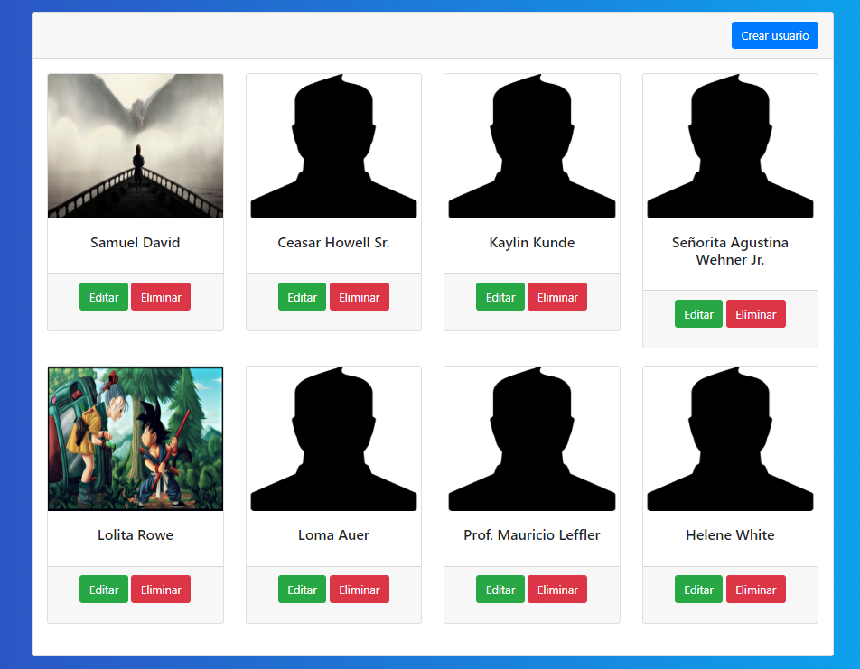
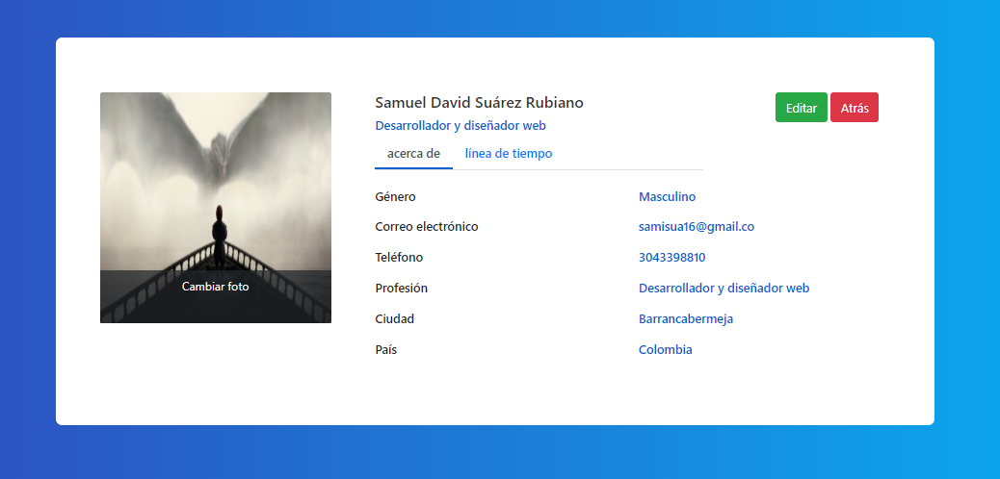
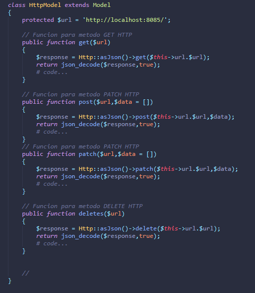
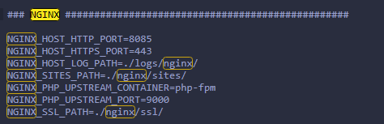
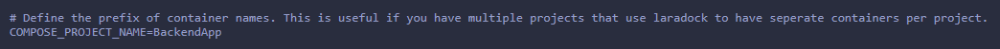
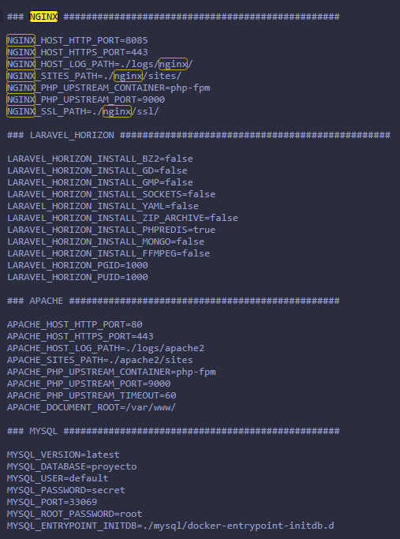
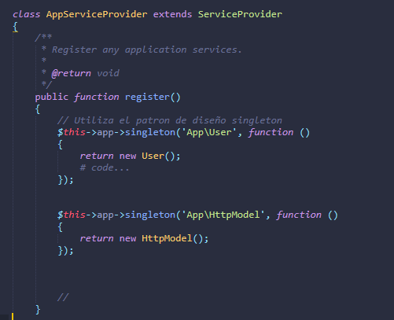
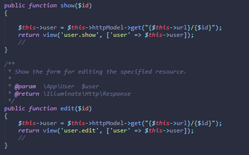
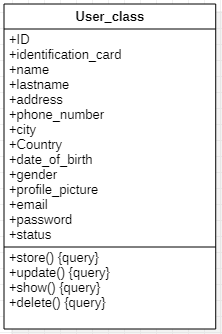
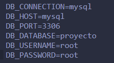

# CRUD Básico de usuarios Segundo Avance

El objetivo del presente proyecto es presentar una aplicación web que, a través de microservicios, pueda crear, consultar, editar y eliminar usuarios de una base de datos. El proyecto se entregara en 3 avances principales, el tercer y ultimo avance será una aplicación modular que se ejecute en contenedores de docker y así facilitar la administración de dichos módulos


# Tecnologias usadaas

En el proyecto se emplearan las siguientes tecnologías

- Laravel/Lumen
- Vue.js
- Docker
- Mysql
- Guzzle

## Avances importantes

-La aplicación paso de ser monolitica a modular
-Cambios en la interfaz de usuario de las vistas
-Se añadió Guzzle
-Laradock
-Patrones de Diseño
-Controladores
-Uso de repositorio git y github

### Aplicacion Modular

Inicialmente la aplicación contaba con el back-end y front-end en el mismo archivo, sin embargo esto va en contra de lo planteado inicialmente, que fuera una aplicación modular.
### Interfaz de usuario

Para hacer mas estilizadas las se realizaron cambios importantes en las vistas de *Consulta de usuarios*


Tambien se modifico la vista del *perfil de usuario*



### Guzzle
Guzzle es un cliente HTTP PHP que facilita el envío de solicitudes HTTP y trivial de integrar con servicios web.

-   Interfaz sencilla para crear cadenas de consulta, solicitudes POST, streaming de grandes cargas, streaming de descargas grandes, uso de cookies HTTP, carga de datos JSON, etc...
-   Puede enviar solicitudes sincrónicas y asincrónicas con la misma interfaz.
-   Utiliza interfaces PSR-7 para solicitudes, respuestas y secuencias. Esto le permite utilizar otras bibliotecas compatibles con PSR-7 con Guzzle.
-   Abstrae el transporte HTTP subyacente, lo que le permite escribir código agnóstico de entorno y transporte; es decir, no hay dependencia dura de cURL, secuencias PHP, sockets o bucles de eventos sin bloqueo.
-   El sistema de middleware le permite aumentar y componer el comportamiento del cliente.





### Laradock

**Laradock**  es un entorno de desarrollo PHP completo para Docker.
Laradock nos proporciono toda la estructura del *docker-compose.yml* y el *Dockerfile* utilizados para crear los contenedores necesarios que permiten la virtualización de la aplicación
**Proceso de instalacion en proyecto ya creado**
-En la carpeta donde se encuentra el proyecto abrir la terminal y ejecutar
```shell
git clone https://github.com/Laradock/laradock.git
```
posteriormente realizar los siguientes comando para el archivo *.env* de **Laradock** (**Nota**: no es el mismo de el proyecto de laravel)
```shell
cd laradock
cp env-example .env
```
Ejecute sus contenedores:

```shell
docker-compose up -d nginx mysql
```
De ser necesario cambiar los puertos de *nginx* y *mysql* en el archivo punto *.env* de la carpeta **Laradock**





Al tener varios proyectos para ejecutar, se debe realizar el cambio de prefijo en  el archivo punto *.env* de la carpeta **Laradock**




Configuracion variables de entorno **Laradock**



### Patrones de diseño

Laravel permite utilizar el patron de diseño singleton, esta configuracion debe hacerse en el archivo **AppServiceProvider**



### Controladores

Se realizo optimizacion de codigo en el controlador de usuarios, con el fin de que fuera compatible con una aplicacion modular y Guzzle



## Progreso de Desarrollo

|Tecnologia| Avance |
|--|--|
|  Docker|40%  |
|  Front End|70%  |
|  Back End|70%  |
|  Base de Datos|50%  |


## Estimación de tiempo


|Tecnología| Tiempo (H) |
|--|--|
|  Docker|20  |
|  Front End|8  |
|  Back End|10|
|  Base de Datos|2 |

## Tercera Entrega

### Estructuras de Datos




### Patrón de diseño Singleton

Es un patrón de diseño cuya función es instanciar un único objeto de una clase para garantizar acceso global a ella. En otras palabras, restringe la creación de objetos de una clase a uno solo.

- Reducir el espacio.
- Controla el acceso a la instancia única.
- Reduce el número de variables.
- Permite cambiar el número de instancias.

El patrón Singleton se uso para la clase user en la API y, en el front-end, se utilizó para instanciar la clase la clase HttpModel y user, su aplicación se encuentra en ambos casos en la ruta app/Providers/AppServiceProviders.php

### Herramientas necesarias para la ejecución del proyecto


- Docker
- Php 7.3 o superior
- Laragon

Modular:
- Iniciar Docker
- En la ruta lumen_project/.env cambiar las variables de entorno de mysql

- Abrir una terminal en la carpeta laradock dentro de laragon/www
- Ejecutar el comando docker-compose.yml up -d nginx mysql
- Abrir terminal en la carpeta Api-Guzzle y ejecutar el comando php -S localhost:8000 -t public
- Abrir el navegador en “localhost:8000/user”.

## Estimación de tiempo


|Tecnología| Tiempo (H) |
|--|--|
|  Docker|22  |
|  Front End|25  |
|  Back End|16|
|  Base de Datos|4 |